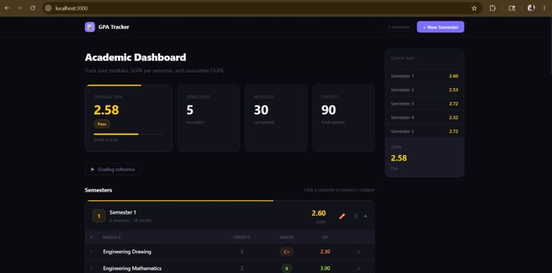

# GPA Calculator

A responsive web app to track semester GPA (SGPA) and overall GPA (OGPA).
Built with **Next.js 14** and stores data in the browser using **localStorage**, so no backend is required.

## Live Demo

[View Live App](https://gpa-calculater-pi.vercel.app)

## Screenshot

## Features

* Add new semesters
* Rename semesters
* Expand and collapse semester sections
* Delete semesters
* Add modules with module name, credit value, and grade
* Delete modules
* Automatically calculate SGPA for each semester
* Automatically calculate overall GPA / OGPA
* Display total semesters, modules, and credits
* Built-in grading reference table
* Responsive dark dashboard interface
* Data saved locally in the browser using localStorage

## Tech Stack

* Next.js 14
* React
* JavaScript
* CSS
* localStorage

## Grading Scale

| Grade | Marks Range  | GPV  | Description      |
| ----- | ------------ | ---- | ---------------- |
| A+    | 85 and above | 4.00 | Excellent        |
| A     | 75 – 84      | 4.00 | Excellent        |
| A-    | 70 – 74      | 3.70 | Very Good        |
| B+    | 65 – 69      | 3.30 | Good             |
| B     | 60 – 64      | 3.00 | Good             |
| B-    | 55 – 59      | 2.70 | Satisfactory     |
| C+    | 50 – 54      | 2.30 | Pass             |
| C     | 45 – 49      | 2.00 | Pass             |
| C-    | 40 – 44      | 1.70 | Weak Pass        |
| D     | 35 – 39      | 1.30 | Conditional Pass |
| E     | 00 – 34      | 0.00 | Fail             |

## Getting Started

Follow these steps to run the project locally.

# 1. Clone the repository
git clone https://github.com/GimhaniDilmika/gpa-calculater.git

# 2. Go into the project folder
cd gpa-calculater

# 3. Install dependencies
npm install

# 4. Run the development server
npm run dev

Open the app in your browser:

http://localhost:3000

## Project Structure

gpa-calculator/
├── app/
│   ├── layout.jsx          # Root layout
│   ├── page.jsx            # Main page
│   └── globals.css         # Global styles
├── components/
│   ├── StatsBar.jsx        # OGPA, semester, module, and credit summary
│   ├── SemesterCard.jsx    # Semester card with module table
│   ├── AddModuleForm.jsx   # Form to add module details
│   └── GradeReference.jsx  # Collapsible grading scale table
├── lib/
│   ├── gpaCalculator.js    # SGPA / OGPA calculation logic and grade data
│   └── useGPA.js           # React hook for state management and localStorage
├── 1780254468905.jpg       # App screenshot
├── package.json
├── package-lock.json
├── next.config.js
├── jsconfig.json
└── README.md

## How GPA Is Calculated

The app calculates GPA using credit-weighted grade points.

SGPA = Total weighted grade points for one semester / Total credits in that semester

OGPA = Total weighted grade points for all semesters / Total credits for all semesters

Example:

Module 1: 3 credits × 4.00 = 12.00
Module 2: 3 credits × 3.00 = 9.00

Total weighted points = 21.00
Total credits = 6

SGPA = 21.00 / 6 = 3.50

## Customising the Grading Scale

To change the grading scale, edit this file:

lib/gpaCalculator.js

Update these objects:

GRADE_POINTS
GRADE_DESCRIPTIONS

After changing them, SGPA, OGPA, grade labels, and colour coding will update automatically.

## Deployment

To build the project:

npm run build

To start the production server:

npm run start

You can also deploy this project using Vercel.

Steps:

1. Push the project to GitHub.
2. Go to Vercel.
3. Import the GitHub repository.
4. Click Deploy.

## Repository

GitHub Repository:
https://github.com/GimhaniDilmika/gpa-calculater.git

## Author

Developed by **GimhaniDilmika**.
